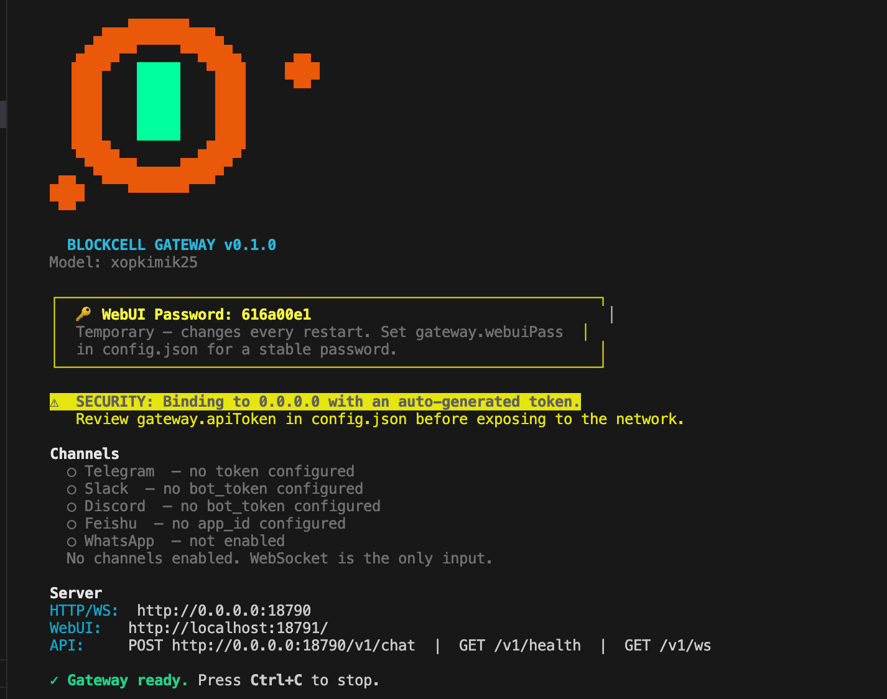
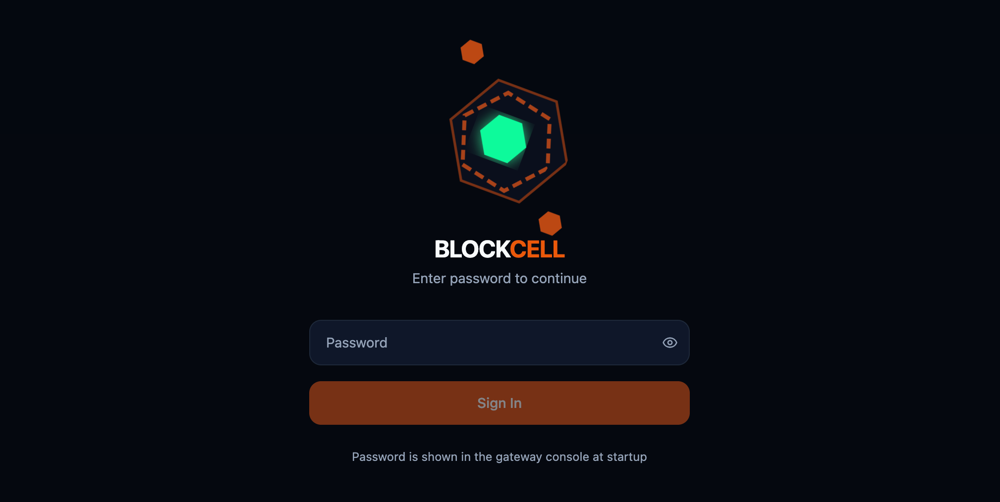
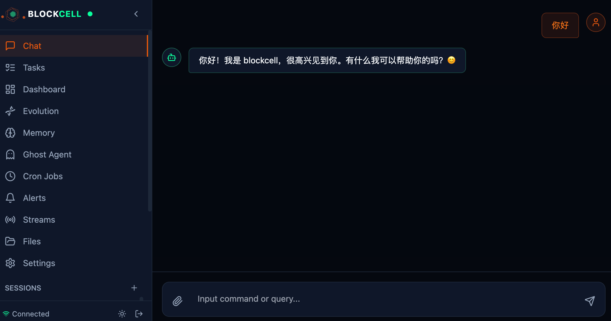

# Quick Start

This repo contains **blockcell**, a self-evolving AI agent framework in Rust.

- It runs as an interactive CLI (`blockcell agent`) or a daemon (`blockcell gateway`).
- It supports tool-calling, a built-in tool registry, background tasks/subagents, and a WebUI.

## 1) Install

### Option A: Install script (recommended)

```bash
curl -fsSL https://raw.githubusercontent.com/blockcell-labs/blockcell/refs/heads/main/install.sh | sh
```

By default, this installs `blockcell` to `~/.local/bin`.

### Option B: Build from source

Prereqs: Rust 1.75+

```bash
cargo build -p blockcell --release
```

The binary will be at `target/release/blockcell`.

## 2) Create config

For first-time setup, the recommended flow is:

```bash
blockcell setup
```

It creates `~/.blockcell/`, saves provider settings, and auto-fills a default `channelOwners` binding when you enable an external channel. If you later want different accounts of the same channel to route to different agents, add `channelAccountOwners` manually. If you prefer the older manual flow, you can still run `blockcell onboard` and edit `~/.blockcell/config.json` yourself.

## 3) Run (interactive)

```bash
blockcell status
blockcell agent
```

Tips:

- Type `/tasks` to see background tasks.
- Type `/quit` to exit.

## 4) Run (daemon + WebUI)

Start the gateway:

```bash
blockcell gateway
```

Default ports:

- API server: `http://localhost:18790`
- WebUI: `http://localhost:18791`

If `gateway.apiToken` is set, use it as:

- HTTP: `Authorization: Bearer <token>` (or `?token=<token>`)
- WebSocket: `?token=<token>` also works

WebUI authentication is now separate from the API token:

- if `gateway.webuiPass` is set, WebUI uses that stable password
- otherwise Gateway prints a temporary password at startup
- if `gateway.apiToken` is empty, Gateway auto-generates and persists one

## Screenshots






