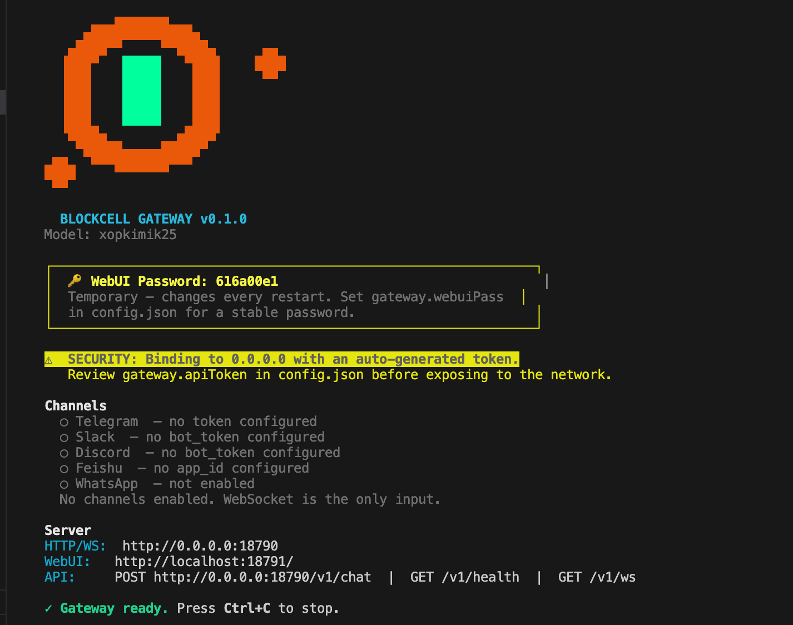
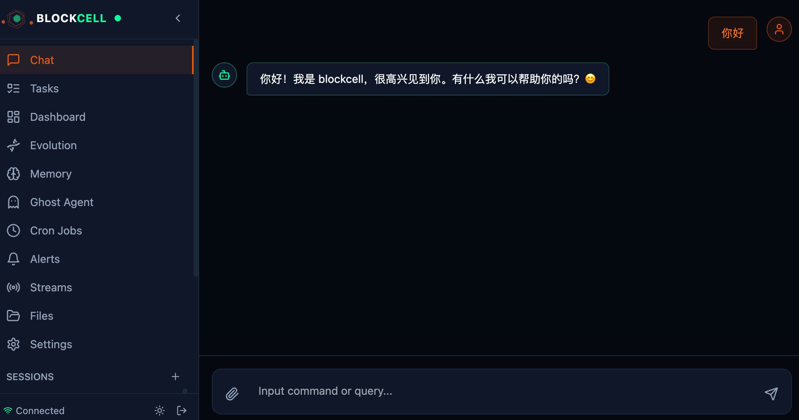

# BlockCell

<div align="center">

**A self-evolving AI agent framework built with Rust**

[](LICENSE)
[](https://www.rust-lang.org)
[](https://github.com/blockcell-labs/blockcell)

[Website](https://blockcell.dev) • [Documentation](https://blockcell.dev/docs) • [中文](README.md)

</div>

---

## 🌟 What Makes BlockCell Different

BlockCell isn't just another chatbot — it's an AI agent that **actually executes tasks**. While ChatGPT can only tell you what to do, BlockCell can:

- 📁 Read and write files on your system
- 🌐 Control browsers and automate web tasks
- 📊 Analyze Excel/PDF files and generate reports
- 💰 Monitor stock prices and crypto markets
- 📧 Send emails and messages across platforms
- 🔄 **Evolve itself** — automatically fix bugs and deploy improvements

```
You: "Monitor Tesla stock and alert me if it drops below $200"
BlockCell: ✓ Sets up monitoring → ✓ Checks price every hour → ✓ Sends Telegram alert
```

---

## 🎯 The Name

> *"Simplest units, most complex whole."*

**BlockCell** is inspired by the **Replicators** from *Stargate* — mechanical life forms built from countless tiny, independent blocks. Each block is simple, but together they form ships, soldiers, and minds. They adapt instantly, evolve faster than any weapon can counter, and cannot be destroyed.

That philosophy lives in this framework:

- **Block** → Immutable Rust host: secure, stable, deterministic
- **Cell** → Mutable skills layer: living, self-repairing, endlessly evolving

Traditional software dies the moment it ships. BlockCell is meant to be **alive**.

→ [Full naming story](https://blockcell.dev/naming-story)

---

## ✨ Key Features

### 🛠️ 50+ Built-in Tools

- **Files & System**: Read/write files, execute commands, process Excel/Word/PDF
- **Web & Browser**: Web scraping, headless Chrome automation (CDP), HTTP requests
- **Finance**: Real-time stock quotes (CN/HK/US), crypto prices, DeFi data
- **Communication**: Email (SMTP/IMAP), Telegram, Slack, Discord, Feishu
- **Media**: Screenshots, speech-to-text (Whisper), chart generation, Office file creation
- **AI**: Image understanding, text-to-speech, OCR

### 🧬 Self-Evolution System

When the AI repeatedly fails at a task, BlockCell can:

1. Detect the error pattern
2. Generate improved code using LLM
3. Automatically audit, compile, and test
4. Deploy via canary rollout (10% → 50% → 100%)
5. Auto-rollback if performance degrades

```
Error detected → LLM generates fix → Audit → Test → Canary deploy → Full rollout
                                                    ↓ on failure
                                                 Auto rollback
```

### 🌐 Multi-Channel Support

Run BlockCell as a daemon and connect it to:

- **Telegram** (long polling)
- **WhatsApp** (via mautrix bridge)
- **Feishu/Lark** (WebSocket)
- **Slack** (REST polling)
- **Discord** (Gateway WebSocket)
- **DingTalk** (Stream SDK)
- **WeCom** (企业微信)

### 🏗️ Rust Host + Rhai Skills Architecture

```
┌─────────────────────────────────────────────┐
│         Rust Host (Trusted Core)            │
│  Message bus | Tool registry | Scheduler    │
│  Storage | Auditing | Security              │
└─────────────────────────────────────────────┘
                     ↕
┌─────────────────────────────────────────────┐
│       Rhai Skills (Mutable Layer)           │
│  Custom skills | Auto-generated code        │
│  Evolvable | Sandboxed | Hot-reloadable     │
└─────────────────────────────────────────────┘
```

- **Rust host**: Immutable, secure, high-performance foundation
- **Rhai skills**: Flexible, evolvable, AI-generated capabilities

---

## 🚀 Quick Start

### Installation (Recommended)

```bash
curl -fsSL https://raw.githubusercontent.com/blockcell-labs/blockcell/main/install.sh | sh
```

This installs `blockcell` to `~/.local/bin`. To customize the location:

```bash
BLOCKCELL_INSTALL_DIR="$HOME/bin" \
curl -fsSL https://raw.githubusercontent.com/blockcell-labs/blockcell/main/install.sh | sh
```

### Build from Source

**Prerequisites**: Rust 1.75+

```bash
git clone https://github.com/blockcell-labs/blockcell.git
cd blockcell
cargo build --release
```

### First Run

```bash
# Initialize configuration
blockcell onboard

# Edit config and add your API key
# ~/.blockcell/config.json

# Start interactive mode
blockcell agent
```

### Daemon Mode (with WebUI)

```bash
blockcell gateway
```

- **API Server**: `http://localhost:18790`
- **WebUI**: `http://localhost:18791`

---

## 📸 Screenshots

<div align="center">

### Gateway Mode


### WebUI Interface


</div>

---

## ⚙️ Configuration

Minimal configuration example (`~/.blockcell/config.json`):

```json
{
  "providers": {
    "openrouter": {
      "apiKey": "YOUR_API_KEY",
      "apiBase": "https://openrouter.ai/api/v1"
    }
  },
  "agents": {
    "defaults": {
      "model": "anthropic/claude-sonnet-4-20250514"
    }
  }
}
```

### Supported LLM Providers

- **OpenAI** (GPT-4o, GPT-4.1, o1, o3)
- **Anthropic** (Claude 3.5 Sonnet, Claude 4)
- **Google Gemini** (Gemini 2.0 Flash, Pro)
- **DeepSeek** (DeepSeek V3, R1)
- **Kimi/Moonshot**
- **MiniMax** ([MiniMax 2.5](https://www.minimaxi.com/))
- **Zhipu AI** ([GLM-5](https://bigmodel.cn/))
- **SiliconFlow** ([SiliconFlow](https://siliconflow.cn/))
- **Ollama** (local models, fully offline)
- **OpenRouter** (unified access to 200+ models)

---

## 🔧 Optional Dependencies

For full functionality, install these tools:

- **Charts**: Python 3 + `matplotlib` / `plotly`
- **Office**: Python 3 + `python-pptx` / `python-docx` / `openpyxl`
- **Audio**: `ffmpeg` + `whisper` (or use API backend)
- **Browser**: Chrome/Chromium (for CDP automation)
- **macOS only**: `chrome_control`, `app_control`

---

## 📚 Documentation

- [Quick Start Guide](QUICKSTART.md)
- [Architecture Deep Dive](docs/en/12_architecture.md)
- [Tool System](docs/en/03_tools_system.md)
- [Skill System](docs/en/04_skill_system.md)
- [Memory System](docs/en/05_memory_system.md)
- [Channel Configuration](docs/en/06_channels.md)
- [Self-Evolution](docs/en/09_self_evolution.md)

---

## 🏗️ Project Structure

```
blockcell/
├── bin/blockcell/          # CLI entry point
└── crates/
    ├── core/               # Config, paths, shared types
    ├── agent/              # Agent runtime and safety
    ├── tools/              # 50+ built-in tools
    ├── skills/             # Rhai engine & evolution
    ├── storage/            # SQLite memory & sessions
    ├── channels/           # Messaging adapters
    ├── providers/          # LLM provider clients
    ├── scheduler/          # Cron & heartbeat
    └── updater/            # Self-upgrade system
```

---

## 🤝 Contributing

We welcome contributions! Here's how to get started:

1. Fork the repository
2. Create a feature branch (`git checkout -b feature/amazing-feature`)
3. Commit your changes (`git commit -m 'Add amazing feature'`)
4. Push to the branch (`git push origin feature/amazing-feature`)
5. Open a Pull Request

See [CONTRIBUTING.md](CONTRIBUTING.md) for detailed guidelines.

---

## 🔒 Security

- **Path safety**: Automatic validation of file system access
- **Sandboxed execution**: Rhai scripts run in isolated environment
- **Audit logging**: All tool executions are logged
- **Gateway authentication**: Bearer token support for API access

In interactive mode, operations outside `~/.blockcell/workspace` require explicit confirmation.

---

## 📊 Use Cases

### Finance Automation
```
"Monitor AAPL stock and alert me if it drops 5%"
"Analyze my portfolio.xlsx and suggest rebalancing"
```

### Data Processing
```
"Read all PDFs in ~/Documents and create a summary spreadsheet"
"Generate a sales report with charts from data.csv"
```

### Web Automation
```
"Check my company's website every hour and alert if it's down"
"Fill out this form on example.com with data from sheet.xlsx"
```

### Communication
```
"Send daily standup summary to #team-updates on Slack"
"Forward urgent emails to my Telegram"
```

---

## 🌍 Community

- **GitHub**: [blockcell-labs/blockcell](https://github.com/blockcell-labs/blockcell)
- **Website**: [blockcell.dev](https://blockcell.dev)
- **Discord**: [Join our community](https://discord.gg/blockcell)
- **Twitter**: [@blockcell_dev](https://twitter.com/@blockcell_ai)

---

## 📝 License

This project is licensed under the MIT License - see the [LICENSE](LICENSE) file for details.

---

## 🙏 Acknowledgments

BlockCell stands on the shoulders of giants:

- [Rust](https://www.rust-lang.org/) - Systems programming language
- [Rhai](https://rhai.rs/) - Embedded scripting engine
- [Tokio](https://tokio.rs/) - Async runtime
- [SQLite](https://www.sqlite.org/) - Embedded database
- [OpenClaw](https://github.com/openclaw/openclaw) - OpenClaw
- [NonaClaw](https://github.com/nonaclaw) - python openclaw

---

<div align="center">

**If you find BlockCell useful, please consider giving it a ⭐️ on GitHub!**

[⭐ Star on GitHub](https://github.com/blockcell-labs/blockcell) • [📖 Read the Docs](https://blockcell.dev/docs) • [💬 Join Discord](https://discord.gg/blockcell)

</div>
