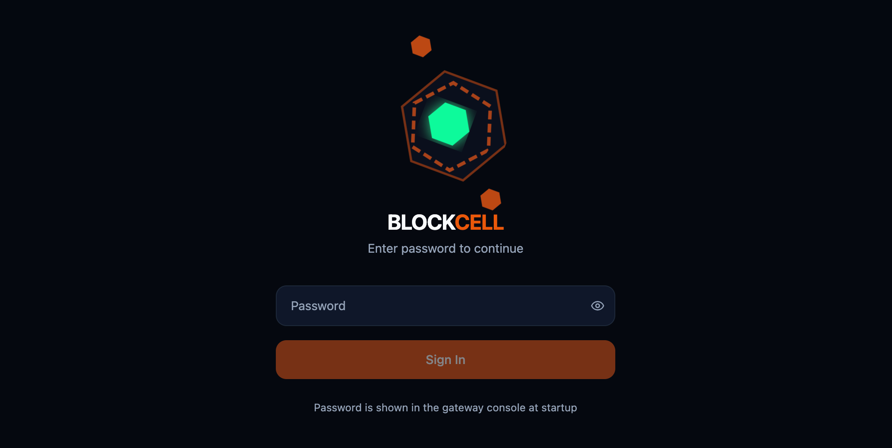

# blockcell

Rust 自进化智能体框架（Host + Skills）。

- 官网: https://blockcell.dev
- English: [README.md](README.md)

## 项目截图





## 项目简介

blockcell 采用“Rust 宿主 + 可变技能”的架构：

- Rust 宿主（TCB）提供强边界：消息总线、工具注册表、调度、存储、审计、升级/回滚。
- Skills（Rhai 脚本）作为可变层，可学习/进化/灰度发布。
- 通过 OpenAI-compatible Provider 连接 OpenRouter / Anthropic / OpenAI / DeepSeek 等模型服务。

## 当前实现包含（基于代码现状）

- CLI/守护进程：`blockcell onboard|status|agent|gateway|doctor|config|tools|run|channels|cron|memory|skills|evolve|alerts|streams|knowledge|upgrade|logs|completions`
- ToolRegistry + JSON Schema 参数校验（避免 LLM 因参数错误陷入死循环）
  - 文件/命令/网页搜索与抓取
  - CDP 无头浏览器：可持久会话 + 可访问性树快照 + 元素引用（`@e1`、`@e2`...）
  - 邮件（SMTP/IMAP）、Whisper 转写、图表生成（matplotlib/plotly）、Office 生成（PPTX/DOCX/XLSX）
- 状态默认落在 `~/.blockcell/`（config、workspace、sessions、audit、cron、media、update）
- SQLite + FTS5 记忆库（全文检索），配套 `memory_*` 工具
- 子代理并发 + 任务管理（`spawn`、`/tasks`）
- 调度器：Cron + Heartbeat 统一通过“注入消息”驱动（`blockcell-scheduler`）
- 宿主自升级骨架：manifest + 校验 + 原子切换 + 回滚（`blockcell-updater`）
- Gateway API + WebUI：HTTP `/v1/chat` + WebSocket `/v1/ws`，内置 WebUI 静态服务

## 目录结构

- `bin/blockcell` - CLI 入口
- `crates/core` - 配置、路径、通用类型
- `crates/agent` - Agent 主循环 + 路径安全确认
- `crates/tools` - 内置工具与注册表
- `crates/skills` - Rhai 引擎、技能管理/进化服务、能力注册表/核心进化
- `crates/storage` - sessions、audit、memory（SQLite）
- `crates/scheduler` - cron + heartbeat
- `crates/channels` - Telegram/WhatsApp/飞书适配（feature gate）
- `crates/providers` - OpenAI-compatible Provider 客户端
- `crates/updater` - 自升级能力
- `docs/` - 设计文档（架构、记忆、技能分享）
- `refs/` - 参考实现快照（用于行为对齐/对照）

## 快速开始

更详细的步骤请看：[QUICKSTART.zh-CN.md](QUICKSTART.zh-CN.md)

### 安装（推荐）

```bash
curl -fsSL https://raw.githubusercontent.com/blockcell-labs/blockcell/refs/heads/main/install.sh | sh
```

默认安装到 `~/.local/bin`，也可以指定安装路径：

```bash
BLOCKCELL_INSTALL_DIR="$HOME/bin" \
curl -fsSL https://raw.githubusercontent.com/blockcell-labs/blockcell/refs/heads/main/install.sh | sh
```

### 源码编译

必需：Rust 1.75+。

可选工具依赖（按需安装）：

- 图表：Python 3 + `matplotlib` / `plotly`
- Office：Python 3 + `python-pptx` / `python-docx` / `openpyxl`
- 语音：`ffmpeg` + `whisper`（或 whisper.cpp），也可走 API 后端
- 浏览器自动化：Chrome/Chromium（CDP）
- macOS 专属工具：`chrome_control`、`app_control`

运行：

```bash
blockcell onboard
# 编辑 ~/.blockcell/config.json，填入一个 provider 的 apiKey（例如 providers.openrouter.apiKey）
blockcell status
blockcell agent
```

守护进程模式（channels + cron + heartbeat）：

```bash
blockcell gateway
```

默认端口（来自配置默认值）：

- API 服务：`0.0.0.0:18790`
- WebUI：`localhost:18791`

## 配置说明

`blockcell onboard` 会生成 `~/.blockcell/config.json`。最常见的做法是只把 `providers.<name>.apiKey` 填上即可。

示例（仅展示关键字段）：

```json
{
  "providers": {
    "openrouter": {
      "apiKey": "YOUR_KEY",
      "apiBase": "https://openrouter.ai/api/v1"
    }
  },
  "agents": {
    "defaults": {
      "model": "anthropic/claude-sonnet-4-20250514"
    }
  }
}
```

## 备注

- 交互模式下，文件/命令工具如果访问 `~/.blockcell/workspace` 以外路径，会要求你确认；单次消息模式默认拒绝外部路径。
- Gateway 模式不会弹交互确认；访问 workspace 以外路径默认拒绝（更安全）。
- Gateway 鉴权：
  - 如果配置了 `gateway.apiToken`，调用 API 需要 `Authorization: Bearer <token>`（或 `?token=<token>`）。
  - WebUI 登录密码与该 token 相同。
- 渠道模块通过 Cargo features 控制（`bin/blockcell` 默认启用）：`telegram` / `whatsapp` / `feishu` / `slack` / `discord`。

## License

MIT

