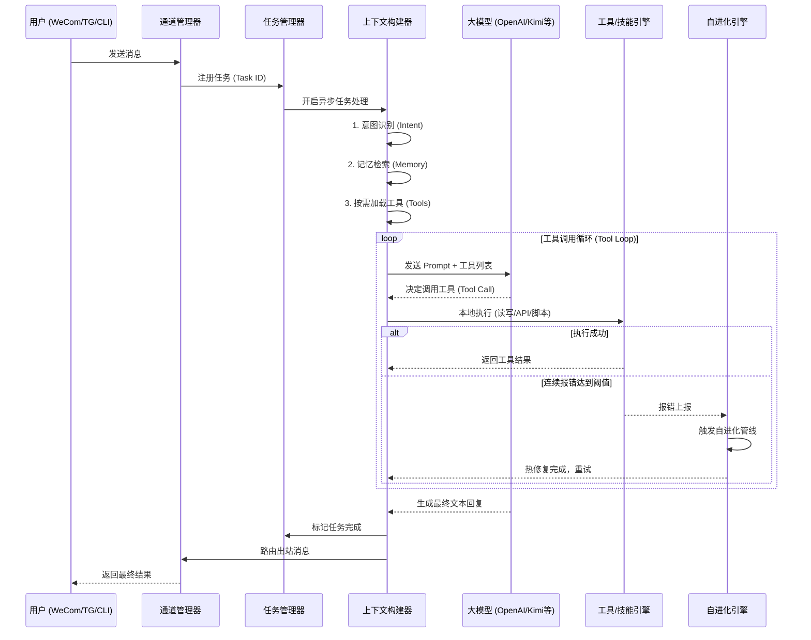

# 第13篇：消息处理与自进化生命周期 —— 从收到消息到触发进化的全过程

> 系列文章：《blockcell 开源项目深度解析》第 13/14 篇

---

在上一篇文章中，我们了解了 blockcell 的整体架构。这一篇我们把视角拉近：跟随一条普通的用户消息，看看它在 blockcell 内部是如何被并发处理、如何触发工具调用，以及在连续失败时如何启动 **自进化（Self-Evolution）** 完成自动修复。

---

## 整体流程概览

当你在微信、Telegram 或终端里对 blockcell 说出一句“帮我查一下苹果公司的股价”时，系统内部会经历四个核心阶段：

1. **消息接收与任务分发**：非阻塞的并发处理
2. **意图识别与上下文构建**：精准组装 Prompt，节省 Token
3. **模型推理与工具循环**：大模型与本地环境的真实交互
4. **结果响应与自进化触发**：闭环返回，并在遇到挫折时开启“自我迭代”

下面是整个生命周期的精简流程图：



---

## 核心处理阶段剖析

### 1. 消息接收与任务分发

Blockcell 的设计极度关注并发性能。无论消息来自哪里，都会进入统一的 `run_loop`。

*   **非阻塞架构**：系统会为每条消息生成一个唯一的 `task_id`，注册到 `TaskManager`，然后立刻使用 `tokio::spawn` 扔到后台异步执行。主线程绝不卡顿。
*   **任务可观测**：正因为这种设计，你可以随时输入 `/tasks` 指令，查看当前系统里有多少个任务在排队、运行或失败。

### 2. 意图识别与上下文构建 (Intent & Context)

为了避免把所有工具都扔给大模型导致 Token 爆炸或幻觉，Blockcell 在调用大模型前做了一层“智能拦截”：

1.  **意图分类**：通过正则和关键词，将用户的输入归类为预设的 14 种意图（如 `Finance`, `FileOps`, `WebSearch` 等）。
2.  **按需加载**：如果意图是“日常聊天”，就不加载任何文件操作工具；如果是“金融”，就精准挂载查股票、查链上数据的 API 工具。
3.  **记忆注入**：连接底层的 SQLite 数据库（基于 FTS5 全文搜索），检索跟你这句话相关的历史记忆或偏好，生成一行摘要（Brief）塞进 Prompt。

### 3. 模型推理与工具执行 (The Tool Loop)

这是最核心的交互环节。Blockcell 支持 OpenAI、Kimi、Ollama 等多种模型。

当模型决定调用工具时，执行引擎会接管：
*   **安全拦截**：如果是高危操作（比如修改不在工作区内的文件），引擎会抛出确认请求，要求用户授权。
*   **多层级执行**：工具可能是简单的 Rust 原生函数（如查天气），也可能是复杂的 `Rhai` 脚本编排的技能（如一键生成金融日报）。

### 4. 重点：自进化流程 (Self-Evolution)

这是 Blockcell 与普通“套壳 API”最大的区别。**当工具执行失败时，系统并不会直接双手一摊告诉用户“我做不到”，而是会尝试自己改代码！**

#### 自进化是如何被触发的？

Blockcell 内部有一个 `EvolutionService`（进化服务）。每一次工具调用的失败，都会被记录在案（`report_error`）。
如果在短时间内，某个技能或工具连续报错达到了预设阈值，系统就会切断正常的执行流，触发**自进化管线（Evolution Pipeline）**。

#### 自进化的四个阶段：

1.  **诊断与生成 (Generate)**：将错误堆栈、源码、目标任务打包，发给高智商模型（如 GPT-4o），让其生成修复补丁（Patch）。
2.  **审计 (Audit)**：验证生成的代码是否包含危险指令，是否符合安全规范。
3.  **沙盒测试 (Dry Run & Shadow Test)**：在隔离环境中试运行修复后的代码。如果编译或测试失败，会**带着具体的报错信息重新进行修复**（Retry with feedback）。
4.  **灰度发布 (Rollout)**：如果修复成功，新代码不会立刻全量替换。它会进入“金丝雀发布”状态，只有部分流量会走到新代码。在接下来的多次调用中，如果没有增加新的错误率，才会正式转正。

#### 简明伪代码展示核心逻辑

普通开发者可以通过下面的伪代码，直观理解这段逻辑：

```rust
async fn process_message(user_msg) {
    // 1. 意图识别与组装 Prompt
    let intent = classify_intent(user_msg);
    let tools = get_tools_for_intent(intent);
    let memory = db.query_related_memory(user_msg);
    
    let prompt = build_prompt(intent, memory);
    
    // 2. 核心 Tool Loop
    loop {
        let llm_response = llm.chat(prompt, tools).await;
        
        if llm_response.is_text() {
            // 生成最终回复，跳出循环
            return send_to_user(llm_response.text);
        } 
        
        if llm_response.is_tool_call() {
            // 执行本地工具
            let result = execute_tool(llm_response.tool_call).await;
            
            if result.is_error() {
                // 记录错误
                let error_count = evolution_service.report_error(tool_name, result.error);
                
                // 3. 错误超限，触发自进化！
                if error_count > THRESHOLD {
                    trigger_self_evolution(tool_name).await;
                    // 修复完成后，由于环境已更新，带着提示让 LLM 再试一次
                    prompt.append("之前的错误已被系统底层修复，请重试工具调用。");
                    continue;
                }
            }
            // 将工具结果追加到历史，进入下一轮推理
            prompt.append_tool_result(result);
        }
    }
}

// 进化管线内部逻辑
async fn trigger_self_evolution(tool_name) {
    let mut attempt = 1;
    let max_retries = 3;
    
    while attempt <= max_retries {
        // 让模型写代码修复
        let patch = llm.generate_fix(tool_source_code, error_logs);
        
        // 编译与测试
        let test_result = compile_and_test(patch);
        if test_result.is_ok() {
            // 热重载并灰度发布
            hot_reload_tool(tool_name, patch);
            start_canary_rollout(tool_name);
            return;
        } else {
            // 带着新的编译报错，进入下一轮迭代反馈
            error_logs = test_result.error;
            attempt += 1;
        }
    }
}
```

---

## 结语

blockcell 的消息处理不仅仅是一个简单的 Request-Response 模型，它更像是一个拥有**感知（意图识别）**、**行动（工具执行）**与**反思（自进化）**能力的数字系统。

当你看到它在遇到未知 API 报错时，能在后台自动生成修复补丁、完成审计/编译/测试、再进行灰度发布，并最终把结果可靠地返回给你时，你会真正感受到开源 Agent 的工程化力量。
---

*上一篇：[blockcell 架构深度解析 —— 为什么用 Rust 写 AI 框架](./12_architecture.md)*

*索引：[系列目录](./00_index.md)*

*项目地址：https://github.com/blockcell-labs/blockcell*
*官网：https://blockcell.dev*
