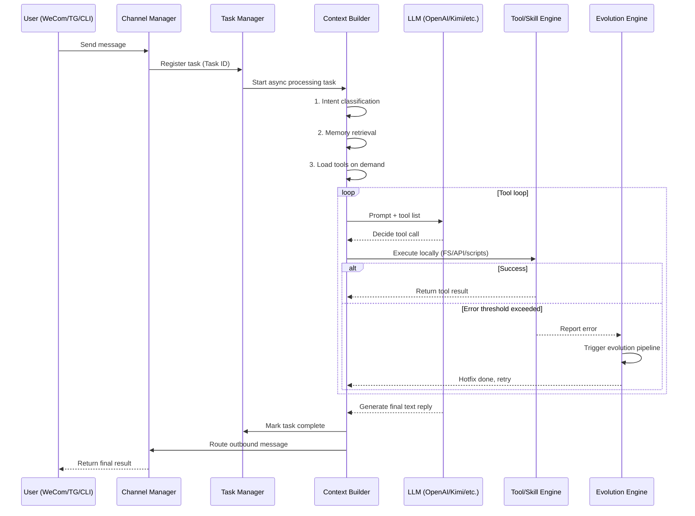

# Article 13: Message Processing and the Self-Evolution Lifecycle — From Receiving a Message to Triggering Evolution

> Series: *In-Depth Analysis of the Open Source Project “blockcell”* — 13/14

---

In the previous article, we looked at blockcell’s overall architecture. In this one, we zoom in: we follow a single user message and see how it is processed concurrently, how it triggers tool calls, and how repeated failures can start **Self-Evolution** to automatically repair the system.

---

## Overview of the lifecycle

When you say something like “check Apple’s stock price” to blockcell (from WeCom, Telegram, or the CLI), internally the system goes through four key stages:

1. **Message ingestion and task dispatch**: non-blocking concurrency
2. **Intent recognition and context building**: precise prompt assembly to save tokens
3. **Model inference and tool loop**: real interaction between LLM and the local environment
4. **Responding and evolution triggers**: a closed loop, and “self-iteration” under setbacks

Here is a simplified lifecycle diagram:



---

## Key stages explained

### 1) Message ingestion and task dispatch

blockcell is designed with concurrency as a first-class concern. No matter where the message comes from, it enters a unified `run_loop`.

- **Non-blocking architecture**: for each message, the system generates a unique `task_id`, registers it in `TaskManager`, and immediately spawns an async task with `tokio::spawn`. The main loop never stalls.
- **Observability**: because tasks are tracked, you can type `/tasks` anytime to see how many tasks are queued, running, or failing.

### 2) Intent recognition and context building

To avoid sending all tools to the LLM (token explosion and hallucinations), blockcell performs “smart gating” before calling the model:

1. **Intent classification**: using regex and keywords, the input is mapped into one of 14 intent categories (e.g. `Finance`, `FileOps`, `WebSearch`).
2. **Load on demand**: for casual chat it loads no file tools; for finance it loads only stock/on-chain tools.
3. **Memory injection**: it queries the SQLite memory store (FTS5 full-text search), retrieves related memories/preferences, and injects a concise brief into the prompt.

### 3) Model inference and the tool loop

This is the core interaction. blockcell supports OpenAI, Kimi, Ollama and others.

When the model decides to call a tool, the execution engine takes over:
- **Safety gate**: for high-risk operations (e.g., accessing files outside the workspace), it raises a confirmation request and requires user approval.
- **Multi-level execution**: a tool can be a simple Rust function, or a complex workflow implemented as a Rhai skill (e.g., generating a daily finance report).

### 4) The key: Self-Evolution

This is where blockcell differs from typical “API wrapper agents”. **When a tool fails, the system doesn’t immediately give up — it tries to fix the code.**

#### How is evolution triggered?

blockcell has an internal `EvolutionService`. Every tool failure is recorded (`report_error`).

If a skill/tool fails repeatedly within a short time window and reaches the configured threshold, the system interrupts the normal flow and triggers the **evolution pipeline**.

#### The four stages of self-evolution

1. **Diagnose & generate**: package stack traces, source code, and target task into a prompt and ask a strong model (e.g. GPT-4o) to produce a patch.
2. **Audit**: verify the generated code does not contain unsafe instructions and follows safety rules.
3. **Sandbox testing**: dry-run and shadow test the patch. If compile/test fails, it retries **with concrete feedback** (retry-with-feedback).
4. **Canary rollout**: if the fix succeeds, it is not deployed to 100% immediately. It starts as a canary and gradually ramps up only if error rate does not increase.

#### Pseudocode to illustrate the core logic

```rust
async fn process_message(user_msg) {
    // 1) Intent classification + prompt assembly
    let intent = classify_intent(user_msg);
    let tools = get_tools_for_intent(intent);
    let memory = db.query_related_memory(user_msg);

    let prompt = build_prompt(intent, memory);

    // 2) Core tool loop
    loop {
        let llm_response = llm.chat(prompt, tools).await;

        if llm_response.is_text() {
            return send_to_user(llm_response.text);
        }

        if llm_response.is_tool_call() {
            let result = execute_tool(llm_response.tool_call).await;

            if result.is_error() {
                let error_count = evolution_service.report_error(tool_name, result.error);

                // 3) Trigger self-evolution on threshold
                if error_count > THRESHOLD {
                    trigger_self_evolution(tool_name).await;
                    prompt.append("The previous failure has been fixed by the system. Please retry the tool call.");
                    continue;
                }
            }

            // Append tool result and continue
            prompt.append_tool_result(result);
        }
    }
}

async fn trigger_self_evolution(tool_name) {
    let mut attempt = 1;
    let max_retries = 3;

    while attempt <= max_retries {
        let patch = llm.generate_fix(tool_source_code, error_logs);

        let test_result = compile_and_test(patch);
        if test_result.is_ok() {
            hot_reload_tool(tool_name, patch);
            start_canary_rollout(tool_name);
            return;
        } else {
            error_logs = test_result.error;
            attempt += 1;
        }
    }
}
```

---

## Closing

blockcell’s message processing is not a simple request-response loop. It’s closer to a digital system with:

- **Perception** (intent recognition)
- **Action** (tool execution)
- **Reflection** (self-evolution)

When you see it automatically generate a patch after encountering an unfamiliar API error, then audit/compile/test it, roll it out gradually, and finally return a reliable result — you can feel the engineering power of an open-source agent system.

---

*Previous: [blockcell architecture deep dive — why Rust for an AI framework](./12_architecture.md)*

*Index: [Series directory](./00_index.md)*

*Repo: https://github.com/blockcell-labs/blockcell*
*Website: https://blockcell.dev*
